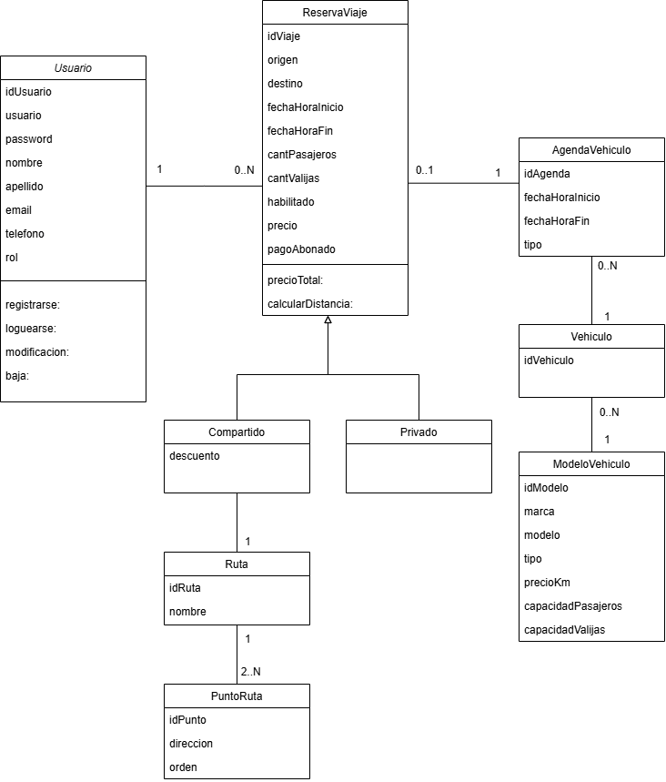

# Propuesta TP DSW

## Grupo
### Integrantes
* 25912 - Gonzalez, Eduardo
* 36640 - Mayer, Rodrigo

### Repositorios
* [frontend app](http://hyperlinkToGihubOrGitlab)
* [backend app](http://hyperlinkToGihubOrGitlab)

## Tema
TMS - Transport Management System
### Descripción
Aplicación web orientada a la gestión integral de reservas de servicios de transporte, permitiendo a los usuarios solicitar viajes indicando origen, destino, fecha, horario, cantidad de pasajeros y requerimientos específicos, facilitando la asignación y administración eficiente de vehículos y reservas.

### Modelo

## Alcance Funcional 

### Alcance Mínimo

Regularidad:
|Req|Detalle|
|:-|:-|
|CRUD simple|1. CRUD Usuario 2. CRUD Ruta|
|CRUD dependiente|1. CRUD Viaje {depende de} CRUD Usuario y CRUD Ruta|
|Listado + detalle| 1. Listado de viajes filtrado por ruta, muestra fecha/hora, con puntos medios y espacio disponible entre cada punto (pasajeros y equipaje) => detalle CRUD Viaje|
|CUU/Epic|1. Reservar un viaje|

Adicionales para Aprobación
|Req|Detalle|
|:-|:-|
|CRUD |1. CRUD ModeloVehiculo 2. CRUD Vehiculo 3. CRUD AgendaVehiculo|
|CUU/Epic|1. Cancelación de reserva 2. Actualizar la agenda de un vehiculo manualmente|

### Alcance Adicional Voluntario

|Req|Detalle|
|:-|:-|
|Listados |1. Viajes del día filtrado por fecha muestra, usuario, vehiculo, fecha/hora origen, fecha/hora destino, origen, destino, precioTotal|
|CUU/Epic|1. Trazabilidad de pago|
|Otros|1. Envío de recordatorio de reserva por email|

