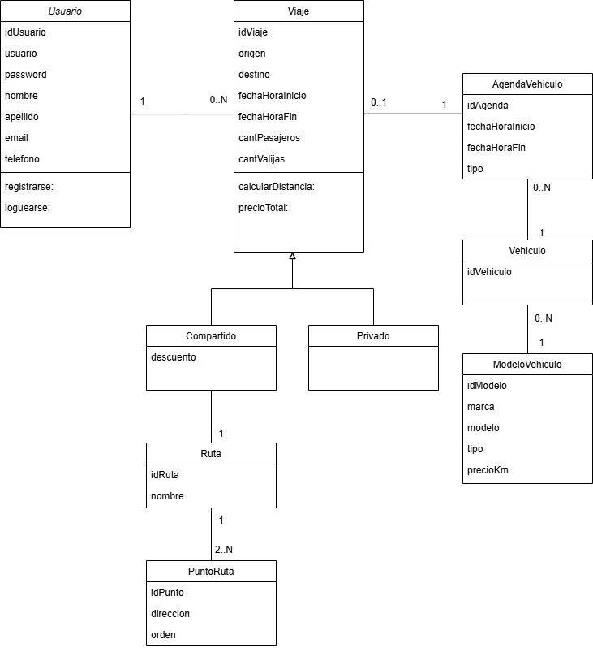

# Propuesta TP DSW

## Grupo
### Integrantes
*       - Gonzalez Eduardo
* 36640 - Mayer, Rodrigo

### Repositorios
* [frontend app](http://hyperlinkToGihubOrGitlab)
* [backend app](http://hyperlinkToGihubOrGitlab)

## Tema
TMS - Transport Management System
### Descripción
Aplicación web para gestionar reservas de servicio de transporte. El usuario define origen, destino, fecha/hora, cantidad de pasajeros y otras especificaciones pormenores.

### Modelo

## Alcance Funcional 

### Alcance Mínimo

Regularidad:
|Req|Detalle|
|:-|:-|
|CRUD simple|1. CRUD Usuario 2. CRUD Ruta|
|CRUD dependiente|1. CRUD Viaje {depende de} CRUD Usuario y CRUD Ruta|
|Listado + detalle| 1. Listado de viajes filtrado por ruta, muestra fecha/hora y espacio disponible (pasajeros y equipaje) => detalle CRUD Viaje|
|CUU/Epic|1. Reservar un viaje|

Adicionales para Aprobación
|Req|Detalle|
|:-|:-|
|CRUD |1. CRUD ModeloVehiculo 2. CRUD Vehiculo 3. CRUD AgendaVehiculo|
|CUU/Epic|1. Cargar nuevo modelo de vehiculo 2. Cargar nuevo vehiculo 3. Actualizar la agenda de un vehiculo manualmente|

### Alcance Adicional Voluntario

|Req|Detalle|
|:-|:-|
|Listados |1. Viajes del día filtrado por fecha muestra, usuario, vehiculo, fecha/hora origen, fecha/hora destino, origen, destino, precioTotal|
|CUU/Epic|1. Cancelación de reserva|
|Otros|1. Envío de recordatorio de reserva por email|

